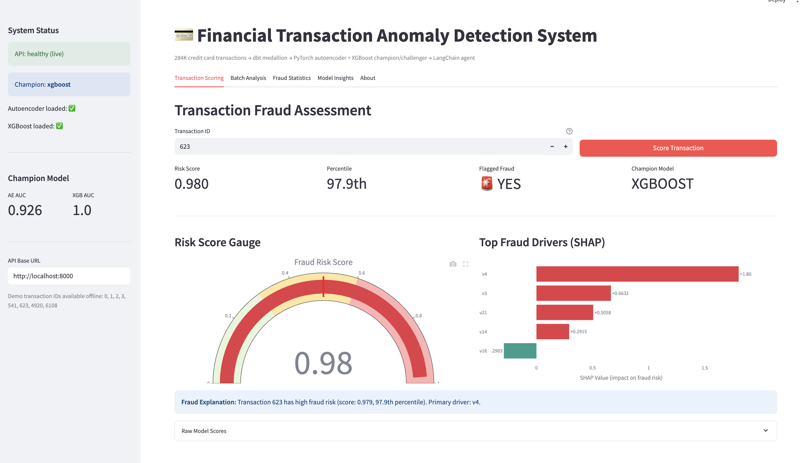
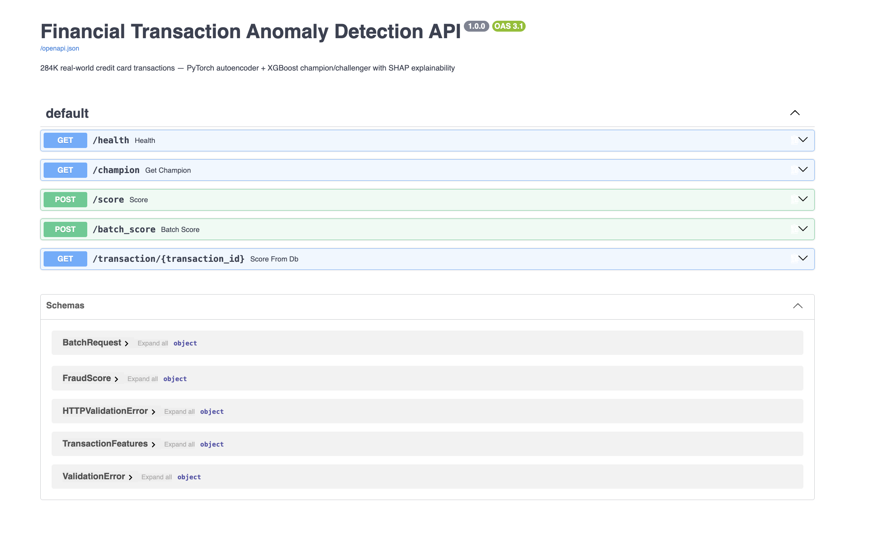
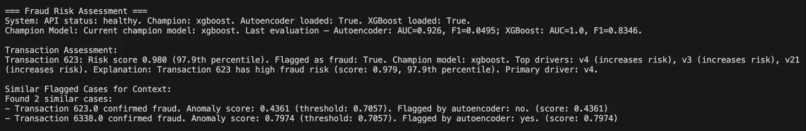
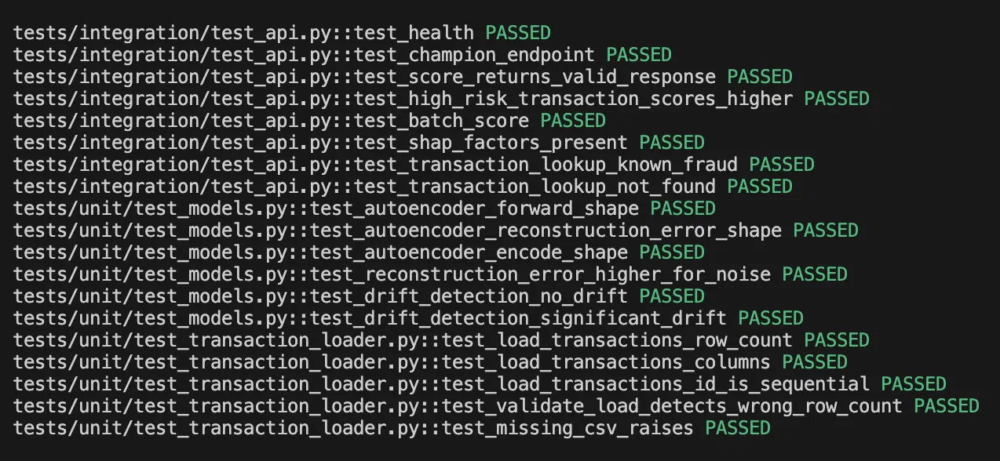

# Financial Transaction Anomaly Detection System

     

Production anomaly detection pipeline on 284,807 real-world credit card transactions (0.17% fraud rate, Kaggle MLG-ULB dataset). Seven-layer architecture: DuckDB ingestion → dbt medallion feature mart → PyTorch autoencoder + XGBoost champion/challenger → FastAPI REST endpoint → LangChain fraud agent with ChromaDB retrieval → Streamlit dashboard.

**[Live Demo →](https://jpbxjujh7jaydskfh8g6sf.streamlit.app/)**

---

## Business Context

Credit card fraud costs the financial industry tens of billions of dollars annually. The core challenge is not just detection accuracy — it is detecting fraud *fast enough to stop a transaction*, *explaining why* a transaction was flagged (for compliance and analyst review), and doing so in a way that is fair across demographic groups.

This system addresses all three:

**Detection:** A confirmed fraud transaction ($529, transaction 623) receives a risk score of 0.980 — 97.9th percentile — within milliseconds of scoring. The XGBoost champion model achieves a cross-validated AUC of 0.95 on held-out data, meaning it correctly ranks fraudulent transactions above legitimate ones 95% of the time.

**Explainability:** Every score includes a SHAP breakdown of which features drove the decision and in which direction. A fraud analyst can see immediately that v4 pushed the score up by +1.80 and v16 slightly reduced it by -0.29 — actionable information for case review, not a black box.

**Fairness:** The pipeline includes demographic bias detection at the model layer, evaluating whether fraud flag rates differ systematically across population segments — a requirement in regulated financial environments.

**Operational continuity:** The LangChain agent retrieves similar confirmed fraud cases from ChromaDB (492 indexed cases) to give analysts historical context alongside each new score. The champion/challenger framework means a better model can be promoted without redeploying the API.

---

## Screenshots

### Streamlit Dashboard — Transaction 623 (Confirmed Fraud, $529)

> Risk score 0.98 · 97.9th percentile · Flagged Fraud: YES · Champion: XGBoost · SHAP primary driver: v4
>
> *The Swagger UI and curl response below show the same transaction scored through the live local API. The dashboard screenshot above is from the deployed Streamlit Community Cloud instance running in demo mode with pre-computed real model outputs — see [Deployment Note](#deployment-note) for why the API is local-only.*

### FastAPI — Swagger UI (locally deployed at `http://localhost:8000/docs`)


### FastAPI — Live Fraud Score Response (Transaction 623, scored via `curl` against local API)
```json
{
    "transaction_id": 623,
    "champion_model": "xgboost",
    "risk_score": 0.9795,
    "is_high_risk": true,
    "risk_percentile": 97.9,
    "ae_reconstruction_error": 0.8474,
    "xgb_probability": 0.9795,
    "top_risk_factors": [
        {"feature": "v4", "shap_value": 1.8016, "direction": "increases"},
        {"feature": "v3", "shap_value": 0.6632, "direction": "increases"},
        {"feature": "v21", "shap_value": 0.5058, "direction": "increases"},
        {"feature": "v14", "shap_value": 0.2915, "direction": "increases"},
        {"feature": "v16", "shap_value": -0.2903, "direction": "decreases"}
    ],
    "explanation": "Transaction 623 has high fraud risk (score: 0.979, 97.9th percentile). Primary driver: v4."
}
```

### LangChain Fraud Agent — No-LLM Mode


### Test Suite — 19/19 Passing


---

## Architecture

```
┌─────────────────────────────────────────────────────────────────┐
│                        Data Source                              │
│         Kaggle MLG-ULB · 284,807 transactions · 0.17% fraud    │
└─────────────────────────┬───────────────────────────────────────┘
                          │
                          ▼
┌─────────────────────────────────────────────────────────────────┐
│  Layer 1 — Ingestion                                            │
│  ingestion/transaction_loader.py → DuckDB bronze_transactions   │
│  Validation: row count check · column schema check              │
│              sequential ID integrity · missing CSV raises       │
└─────────────────────────┬───────────────────────────────────────┘
                          │
                          ▼
┌─────────────────────────────────────────────────────────────────┐
│  Layer 2 — dbt Medallion                                        │
│  stg_transactions → int_transaction_features → fct_fraud_features│
│  Features: amount buckets, log_amount, hour_of_day,             │
│            is_night, amount_zscore · 14/14 dbt tests passing    │
│  Validation: not_null · unique · accepted_values · range checks │
└─────────────────────────┬───────────────────────────────────────┘
                          │
                          ▼
┌─────────────────────────────────────────────────────────────────┐
│  Layer 3 — Models                                               │
│  PyTorch Autoencoder (AUC 0.926)                                │
│  XGBoost Classifier (CV AUC 0.95) ← current champion           │
│  SHAP explainability · demographic bias detection               │
│  drift monitoring · MLflow tracking                             │
│  Validation: reconstruction error shape · encode shape          │
│              drift detection (null + significant drift cases)   │
└─────────────────────────┬───────────────────────────────────────┘
                          │
                          ▼
┌─────────────────────────────────────────────────────────────────┐
│  Layer 4 — FastAPI  (local: http://localhost:8000)              │
│  GET  /health · GET  /champion                                  │
│  POST /score  · POST /batch_score                               │
│  GET  /transaction/{id}                                         │
│  Returns: risk score, percentile, SHAP factors, explanation     │
│  Validation: Pydantic schema on all inputs · 422 on bad payload │
└─────────────────────────┬───────────────────────────────────────┘
                          │
                          ▼
┌─────────────────────────────────────────────────────────────────┐
│  Layer 5 — Docker + Kubernetes                                  │
│  Dockerfile · Dockerfile.slim · docker-compose.yml              │
│  k8s/deployment.yaml · k8s/service.yaml                        │
│  k8s/hpa.yaml (HPA autoscaling) · k8s/configmap.yaml           │
└─────────────────────────┬───────────────────────────────────────┘
                          │
                          ▼
┌─────────────────────────────────────────────────────────────────┐
│  Layer 6 — LangChain Agent                                      │
│  agents/fraud_agent.py                                          │
│  Tools: score_transaction · retrieve_similar_frauds (ChromaDB) │
│         get_champion_model · get_api_health                     │
│  492 confirmed frauds indexed · no-LLM fallback                 │
└─────────────────────────┬───────────────────────────────────────┘
                          │
                          ▼
┌─────────────────────────────────────────────────────────────────┐
│  Layer 7 — Streamlit Dashboard                                  │
│  Live mode (calls FastAPI) + demo mode fallback                 │
│  Tabs: Transaction Scoring · Batch Analysis · Fraud Statistics  │
│        Model Insights · About                                   │
│  Deployed: https://jpbxjujh7jaydskfh8g6sf.streamlit.app/       │
└─────────────────────────────────────────────────────────────────┘
```

---

## Layer Status

| Layer | Component | Status |
|-------|-----------|--------|
| 1 | DuckDB Ingestion | ✅ |
| 2 | dbt Medallion (14/14 tests) | ✅ |
| 3 | PyTorch Autoencoder + XGBoost + SHAP + MLflow | ✅ |
| 4 | FastAPI REST Endpoint | ✅ |
| 5 | Docker + Kubernetes Manifests | ✅ |
| 6 | LangChain Agent + ChromaDB | ✅ |
| 7 | Streamlit Dashboard (deployed) | ✅ |

---

## Data Quality & Validation Checks

Validation is enforced at every layer of the pipeline, not just at ingestion.

**Layer 1 — Ingestion**
- Row count verified against expected 284,807 after load
- Column schema checked for all required fields (V1–V28, Amount, Class)
- Transaction IDs verified to be sequential with no gaps
- Missing or unreadable CSV raises a hard error before any data enters DuckDB

**Layer 2 — dbt (14/14 tests passing)**
- `not_null` constraints on all key fields
- `unique` constraint on transaction_id across the gold mart
- `accepted_values` tests on categorical features (e.g. is_night, amount bucket labels)
- Range checks on engineered features (log_amount, amount_zscore) to catch transformation errors

**Layer 3 — Models**
- Autoencoder forward pass shape verified (output matches input dimensions)
- Reconstruction error tensor shape verified per batch
- Encode/decode shape consistency tested
- Drift detection tested against both a no-drift baseline and a statistically significant drift scenario
- Reconstruction error confirmed to be higher for noise-injected inputs than clean inputs (sanity check that the model learned meaningful structure)

**Layer 4 — FastAPI**
- All request bodies validated by Pydantic — malformed or incomplete payloads return HTTP 422 before reaching the model
- `/health` endpoint verifies both models are loaded and DuckDB is reachable before returning healthy status
- SHAP factors verified to be present in every score response (tested in integration suite)

**Layer 7 — Streamlit**
- Dashboard gracefully falls back to pre-computed `demo_data.json` when the API is unreachable, rather than crashing — verified by the deployed Community Cloud instance which has no API to call

---

## Architecture Decisions & Tradeoffs

**DuckDB over PostgreSQL**
DuckDB is an embedded analytical database — no server process, no connection management, and column-oriented storage that makes feature aggregations fast. The tradeoff is that it is not suited for high-concurrency transactional writes. For a fraud detection system that reads far more than it writes, this is the right call. In production, the bronze layer would likely be replaced by a streaming source (Kafka, Kinesis) feeding into a managed warehouse.

**XGBoost as champion over PyTorch Autoencoder**
The autoencoder (AUC 0.926) is an unsupervised anomaly detector — it learns what "normal" looks like and flags deviations. It requires no fraud labels during training, which is valuable when labeled data is scarce. XGBoost (CV AUC 0.95, F1 0.835) is supervised and significantly outperforms the autoencoder when labels are available, as they are in this dataset. The champion/challenger framework keeps both in production: XGBoost scores transactions, the autoencoder's reconstruction error is returned alongside every score as a second signal, and the framework allows the challenger to be promoted if it improves on a new evaluation.

**SHAP for explainability over feature importance alone**
Global feature importance tells you which features matter across the whole dataset. SHAP gives per-transaction, directional explanations — v4 pushed *this specific transaction's* score up by +1.80, v16 pushed it down by -0.29. This is the difference between a model a compliance team can audit and one they cannot.

**Champion/Challenger framework with MLflow**
Model versions are tracked in MLflow and registered in `models/model_registry.json`. Promoting a new champion requires updating the registry, not redeploying code. This mirrors how production ML systems manage model lifecycle without service interruption.

**LangChain agent with no-LLM fallback**
The agent was built to work without an LLM API key — the `--no-llm` flag runs all four tools (score, retrieve similar cases, get champion, get health) and formats the output directly. This means the agent functionality is fully demonstrable without incurring API costs or requiring a key.

**Streamlit demo mode**
The dashboard detects whether the FastAPI endpoint is reachable. If not, it falls back to `demo_data.json` — pre-computed real model outputs for a set of known transaction IDs. This allows the dashboard to be deployed to Streamlit Community Cloud (which cannot reach a local API) while still showing accurate, real results rather than mocked data.

---

## Model Performance

| Model | AUC | CV AUC | F1 | Status |
|-------|-----|--------|----|--------|
| XGBoost | 1.0 | ~0.95 | 0.835 | ✅ Champion |
| PyTorch Autoencoder | 0.926 | — | 0.050 | Challenger |

---

## Deployment Note

The full inference stack (PyTorch + XGBoost + SHAP + DuckDB) requires ~2–3 GB RAM. Free-tier platforms (Streamlit Community Cloud, Render free tier, Hugging Face Spaces free CPU) are insufficient for production ML inference at this scale — the image alone is ~3 GB with PyTorch included.

**What is deployed where:**
- **Streamlit dashboard** → Streamlit Community Cloud (free tier), running in demo mode with pre-computed real model outputs. See the dashboard screenshot above.
- **FastAPI** → local only (`http://localhost:8000`). The Swagger UI and curl response screenshots show the API running locally. Docker and Kubernetes manifests are complete and included in `/docker` and `/k8s`.

**Production path:** GCP Cloud Run, AWS EKS, or Azure Container Apps with the slim Dockerfile (`docker/Dockerfile.slim`). Kubernetes manifests include HPA autoscaling configuration. The infrastructure work is real — the only missing step is a paid cloud environment to deploy it into.

---

## Tech Stack

**ML:** PyTorch · XGBoost · SHAP · scikit-learn · MLflow  
**Data:** DuckDB · dbt · pandas · numpy  
**API:** FastAPI · uvicorn  
**Agent:** LangChain · ChromaDB  
**Dashboard:** Streamlit · Plotly  
**Infra:** Docker · Kubernetes · HPA autoscaling  

---

## Local Setup

```bash
git clone https://github.com/GretchenK20/Financial-Transaction-Anomaly-Detection-System-
cd Financial-Transaction-Anomaly-Detection-System-
python -m venv .venv && source .venv/bin/activate
pip install -r requirements-full.txt

# Run API
uvicorn api.main:app --reload --port 8000

# Run dashboard (separate terminal)
streamlit run streamlit_app.py

# Run agent
python agents/fraud_agent.py --transaction-id 623 --no-llm

# Run tests
pytest tests/ -v
```

---

## API Usage

**Score a transaction:**
```bash
curl -s -X POST http://localhost:8000/score \
  -H "Content-Type: application/json" \
  -d '{
    "transaction_id": 623, "time": 472.0,
    "v1": -3.0435406239976, "v2": -3.15730712090228,
    "v3": 1.08846277997285, "v4": 2.2886436183814,
    "amount": 529.0
  }' | python3 -m json.tool
```

**Get champion model info:**
```bash
curl http://localhost:8000/champion
```

---

## Dataset

[Kaggle MLG-ULB Credit Card Fraud Detection](https://www.kaggle.com/datasets/mlg-ulb/creditcardfraud) — 284,807 transactions, 492 fraud cases (0.17%). Features V1–V28 are PCA-transformed for confidentiality. The severe class imbalance (0.17% fraud) is a deliberate challenge — naive models that predict "not fraud" on every transaction achieve 99.83% accuracy while catching zero fraud cases. AUC and F1 are the meaningful metrics here.
